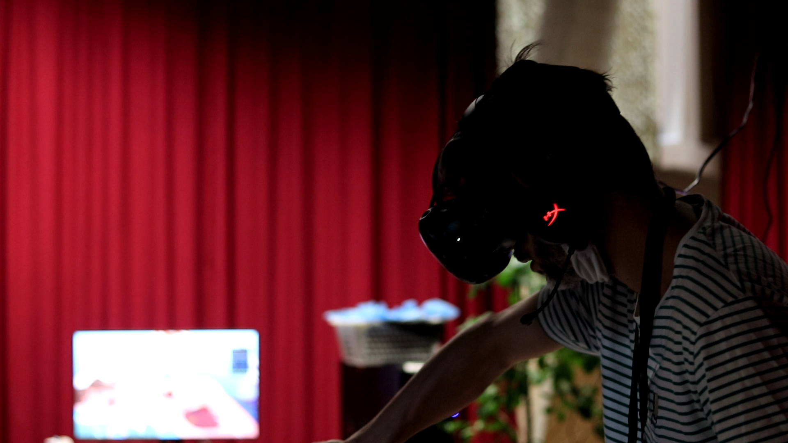
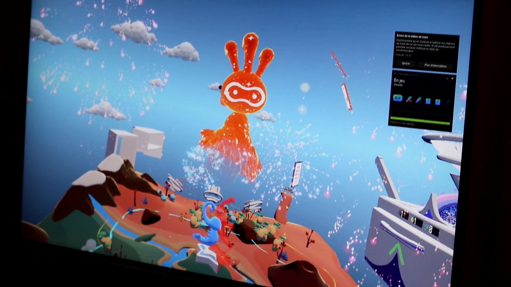
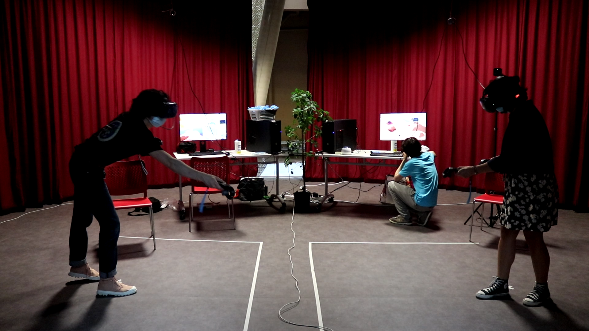
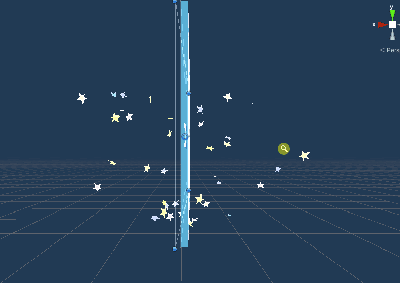

+++
title = 'Divunity'
description = "Le tout premier god-game VR coopératif. Une expérience unique où les joueurs doivent faire cohabiter leur deux peuples."
date = 2024-01-24T19:43:55+01:00
draft = false
image = "thumbnail.png"
toc = true
keywords = ["vr", "game dev", "game design", "portfolio", "coop", "indie"]
readingTime = true
categories = ["Projets", "Portfolio"]
+++

Divunity est une expérience unique, et honnêtement, l'un des projets dont je suis le plus fier. 
C'est un "god game" en VR dans lequel deux joueurs doivent coopérer pour faire cohabiter leurs peuples ensemble malgré la haine qu'ils éprouvent l'un pour l'autre. 
L'accent est mis à la fois sur l'aspect communication/stratégie et sur le plaisir de jouer avec un jouet VR.


# Résumé

Cette vidéo présente les mécaniques du jeu, et montre un playthrough.



# Du concept à la livraison

J'ai eu la chance de présenter cette idée devant mes collègues de promo, et qu'elle soit sélectionnée parmi les 12 projets que nous allions créer. 

Tout a commencé par une vision claire que quelques collègues et moi-même avons eue en 2019. De là est né un concept de jeu brut que j'ai réalisé pour présenter les concepts clés. À partir de là, une équipe de quatre personnes et moi-même avons développé une démo en l'espace de trois mois, qui comprend du réseau et de la physique.

Nous avons ensuite présenté ce jeu au public, et ce grand nombre de nouveaux joueurs a mis en lumière certaines lacunes du design et d'autres problèmes d'expérience utilisateur. La VR n'est pas une mince affaire ! Si ce jeu devenait un jeu à part entière, nous aurions beaucoup de contenu et d'améliorations à apporter. Nous avons beaucoup appris et nous nous sommes beaucoup amusés.

**Mes rôles sur le projet :*
* Game designer
* Programmeur gameplay
* Team leader

# Fait avec soin par

| Credit                | Role                              |
|:---------------------:|:---------------------------------:|
| [Pierre Aceituno]()   | Producer                          |
| [Solène Pobelle]()    | Character & environment artist    |
| [Noé Simon]()         | UX Designer, User Researcher      |
| [Pamphile Saltel]()   | Programmeur                       |

L'idée originale a été imaginée et testée par Marie Abrino, Sohel Bourgeau, Hippolyte Follenfant, Morgan Geniez et moi-même.

# Gallerie
    

-----
# Histoire d'une feature : Le système de demandes

J'ai conçu, prototypé et intégré ce système de jeu du début à la fin. Au cours du jeu, votre peuple vous demandera de construire de nouveaux bâtiments.
C'est la fonctionnalité sur laquelle j'ai le plus travaillé, car elle comprend des éléments de systems design, de technical design, et de narrative design. 

Dans la première itération, les demandes étaient rudimentaires, elles indiquaient simplement un type de bâtiment et une action : construire ou détruire. Cela n'offrait pas beaucoup de variété, on s'ennuyait. De plus, les joueurs ne comprenaient pas vraiment le but du jeu, ni l'impact de leurs actions sur leur peuple.

Nous avons donc remanié le système pour inclure une phrase complète sur ce que le peuple vous demandait de faire, avec un indice de craft au verso. Cela a permis de renforcer l'ambiguïté et la possibilité de choix du joueur. Par exemple, si votre peuple dit "Nous avons peur des autres, faites quelque chose", vous avez deux options : 
* Construire une tour de garde pour qu'ils se sentent en sécurité
* Demander à votre coéquipier de détruire sa tour de garde, afin que votre peuple ne se sente pas menacé.



Cela a ouvert la porte à des demandes beaucoup plus variées et a rendu les enjeux beaucoup plus clairs pour les joueurs.

Les demandes sont générées de manière procédurale en fonction de l'état du jeu, comme le score de chaque joueur ou les bâtiments présents. La plupart des bâtiments de fin de partie (lorsque les deux tribus s'apprécient davantage) vous obligent à utiliser les ressources de votre partenaire, ce qui renforce la coopération à la fois dans la narration et dans le gameplay.

Le jeu se termine par la construction d'une "Merveille", une statue en deux parties, chaque joueur devant construire sa propre partie.

```cs
// Exemple de code d'une requête

// Nous avons écrit des helpers pour évaluer l'état du jeu, par exemple 
// IsMilitary : Si le jeu est à l'ère militaire, c'est-à-dire si les deux peuples se détestent.
new Request
{
    text                = Loc.GetString("On déteste l'autre peuple, faites en sorte qu'on ne les voit plus"),

    // Quel bâtiment afficher sur la requête
    requestedBuilding   = BuildingHelpers.GetBuilding("Wall", true),                                         

    // Prédicat qui détermine quand la demande peut apparaître
    preCond             = r => IsMilitary,                                                                      

    // Prédicat qui détermine si la demande a été satisfaite
    successCond         = r => BuildingHelpers.GetBuilding("Wall", true).JustBuilt(),                        
}
```

Le système de requêtes pourrait être élargi avec beaucoup plus de requêtes impliquant plus de types d'actions, plus de types de bâtiments etc. La forme actuelle des demandes laisse à désirer, car le texte peut être difficile à lire pour certains joueurs. Nous changerions probablement cette forme si nous pouvions continuer à travailler sur le jeu.

# Documentation

La [documentation du jeu](docs) (document de conception du jeu) est disponible à la consultation.
